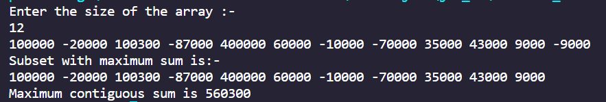
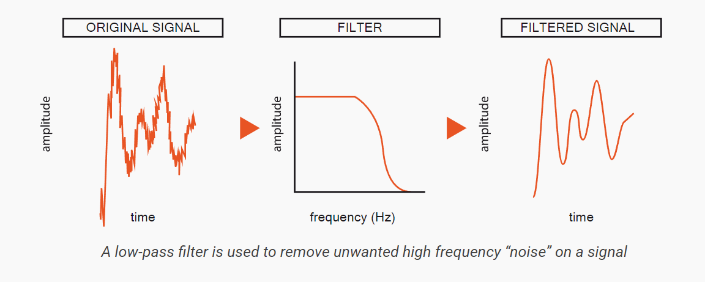

# Sum-of-Subset-problem
<h1>Class Assignment(Daa)</h1>

<b>Name</b>:-Jaiwin Chaudhari 
<b>Roll no</b>:-45 
<b>Section</b> :-A(CSE-I)

<b>Problem Statement</b>:-Sum of Subset problem using Dynamic Programming approach and demonstrate any two applications in the form of test cases.

<b>Theory</b>:- An array a[ ] is given with size 'n'. Sum of Subset problem provides us with the contiguous subset of the array which provides us with maximum sum that a array can provide to the user. Subset can be of any size as problem may contain negative number which might decrease the maximum sum of the array.

<b>Time Complexity</b>- Time Complexity for the Sum of Subset is O(n)

<h2>Application:-</h2>
<h3>1)Business analysis</h3>

Business can use Sum of Subset to analysis their growth as well as the downfall in the particular given duration i.e yearly, monthly, daily.

 

Here is a example of the yearly grown of the Company ABC

<h4>Screenshots</h4>

In above example company made a profit from 1st month to the 11th month of the year. The maximum profit from the respective months was 5,06,300.

<h3>2)Signal Processing</h3>
 

Signal processing involves converting or transforming data in a way that allows us to see things in it that are not possible via direct observation. Signal processing allows engineers and scientists to analyze, optimize, and correct signals, including scientific data, audio streams, images, and video.

Filtering is one of the most basic and important signal processing techniques. It has been used since the very beginning of the analog recording, to enhance our ability to see the true signal by suppressing “noise” and other interferences. Filtering was (and is) used for applications from adjusting the bass and treble response of your music player to adjusting the channel frequency of a radio, and improving sound quality on telephone lines.

